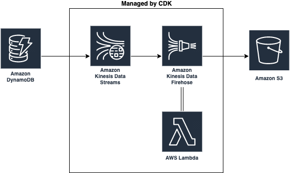

# dynamodb-history-recorder
## Table of Contents

- [About](#about)
- [Usage](#usage)
- [Developing](#developing)

## About <a name = "about"></a>

Save DynamoDB history into S3 via Kinesis Data Streams and Kinesis Data Firehose.



## Usage <a name = "usage"></a>

### 1. Create resources by CDK
```shell-session
$ cd cdk

# Use context parameter
$ cdk deploy -c s3-bucket=<bucket-name> -c s3-prefix=<prefix>

# Or use environment variables
$ S3_BUCKET=<bucket-name> S3_PREFIX=<prefix> cdk deploy

# If you use hive partition, set use-hive-partition=true or USE_HIVE_PARTITION=true. * default is false
$ cdk deploy -c s3-bucket=<bucket-name> -c s3-prefix=<prefix> -c use-hive-partition=true
$ S3_BUCKET=<bucket-name> S3_PREFIX=<prefix> USE_HIVE_PARTITION=true cdk deploy
```

### 2. Enable Kinesis stream destination
Set KDS destination in DynamoDB console or AWS CLI. Stream name is `ddb-history-recorder-kds`.
```shell-session
$ aws dynamodb enable-kinesis-streaming-destination --table-name <ddb-table-name> --stream-arn <kds-arn>
```


### 3. Create Athena table

Create Athena table by Glue crawler or by manual DDL.

Firehose deliveries gzip jsonl files on S3.

*Firehose default style*
```
<bucket>/<prefix>/dest/
└── 2021
    └── 02
        └── 13
            ├── 13
            │   └── ddb-history-recorder-kdh-3-2021-02-13-13-57-38-2661d044-eb93-47ec-a91a-8a0e3e862f77.gz
            └── 14
                ├── ddb-history-recorder-kdh-3-2021-02-13-14-06-04-9002f8da-9f14-41d7-9eed-346fbf0e833f.gz
                ├── ddb-history-recorder-kdh-3-2021-02-13-14-13-51-02571286-f7b2-4aa5-a288-310e5527fb7a.gz
                └── ddb-history-recorder-kdh-3-2021-02-13-14-17-31-91bf4d1f-c58d-4d35-933a-89eda6da0b4e.gz
```

*Hive partition style*
```
<bucket>/<prefix>/dest/
└── year=2021
    └── month=02
        └── day=13
            ├── hour=08
            │   ├── ddb-history-recorder-kdh-3-2021-02-13-08-04-53-f48bba17-f357-4fd0-b4a7-42244fe8ea24.gz
            │   ├── ddb-history-recorder-kdh-3-2021-02-13-08-07-55-6780f426-e5ba-4046-a523-9cf4f1eeda24.gz
            │   ├── ddb-history-recorder-kdh-3-2021-02-13-08-10-56-982073b0-9548-4022-8956-065dba219231.gz
            │   ├── ddb-history-recorder-kdh-3-2021-02-13-08-13-56-a01b7ae8-20a2-4e76-8574-e5d74ca498e7.gz
            │   └── ddb-history-recorder-kdh-3-2021-02-13-08-16-56-1ea96928-959b-4f16-9045-c2034a878621.gz
            ├── hour=09
            │   ├── ddb-history-recorder-kdh-1-2021-02-13-09-46-19-f2cb2363-98f5-4f01-8864-b47549e24c64.gz
            │   ├── ddb-history-recorder-kdh-1-2021-02-13-09-49-00-7aabd9ba-0ca3-44ae-a56c-e206b9e4d83f.gz
            │   ├── ddb-history-recorder-kdh-1-2021-02-13-09-52-00-8b65a634-63e7-44c9-afcc-81e831c855b7.gz
            │   ├── ddb-history-recorder-kdh-1-2021-02-13-09-55-01-063624b1-e890-4550-83ff-ab29dd7467cd.gz
            │   └── ddb-history-recorder-kdh-1-2021-02-13-09-58-01-4681170a-5709-4589-a63e-e814ccbde875.gz
            └── hour=10
                └── ddb-history-recorder-kdh-1-2021-02-13-10-01-01-e4b34370-6a52-4f20-b876-134266016783.gz
```

*Output file sample*
```
$ gzcat 2021/02/13/13/ddb-history-recorder-kdh-3-2021-02-13-13-57-38-2661d044-eb93-47ec-a91a-8a0e3e862f77.gz | head -2
{"recordId":"49615468055550547576769625492807648085490169951249498114000000","approximateArrivalTimestamp":1613224658238,"eventID":"6c8dbc8f-e93d-40bd-b95e-5f8d53a53c70","eventName":"INSERT","tableName":"ddb-history-test","ApproximateCreationDateTime":1613224657698,"SizeBytes":369,"NewImage":{"product":"Keyboard","k1":"8616d48c-bffe-454f-bceb-efea7112268f","jobs":["Future Creative Facilitator","Dynamic Group Developer","Legacy Branding Liaison"],"lon":172.7912,"nullable":50,"country":"Sri Lanka","date":"Mon Apr 13 2020 20:31:12 GMT+0900 (Japan Standard Time)","active":true,"amount":120.98,"lat":-23.7521,"person":{"firstName":"Violet","lastName":"Yundt","age":64},"productName":"Small Cotton Computer"}}
{"recordId":"49615468055550547576769625492808857011309784580424204290000000","approximateArrivalTimestamp":1613224658241,"eventID":"431b64e3-53c7-4fa1-a270-39a5eaa180d8","eventName":"INSERT","tableName":"ddb-history-test","ApproximateCreationDateTime":1613224657843,"SizeBytes":380,"NewImage":{"product":"Table","k1":"06a0aa3a-5833-497e-ba93-2dd4fc621c42","jobs":["Investor Branding Liaison","Human Brand Representative","Human Paradigm Coordinator"],"lon":100.707,"nullable":50,"country":"Philippines","date":"Sat Mar 26 2011 07:40:47 GMT+0900 (Japan Standard Time)","active":true,"amount":735.25,"lat":-35.6098,"person":{"firstName":"Marjolaine","lastName":"Pouros","age":99},"productName":"Incredible Soft Computer"}}
```

If you use [partition projection](https://docs.aws.amazon.com/athena/latest/ug/partition-projection.html), create external table like this.
```sql
CREATE EXTERNAL TABLE `ddb_history_recorder_dest_default`(
  `recordid`                    string, 
  `approximatearrivaltimestamp` bigint, 
  `eventid`                     string, 
  `eventname`                   string, 
  `tablename`                   string, 
  `approximatecreationdatetime` bigint, 
  `sizebytes`                   int,
  `newimage` struct<product:string,k1:string,jobs:array<string>,lon:double,nullable:int,country:string,date:string,active:boolean,amount:double,lat:double,person:struct<firstname:string,lastname:string,age:int>,productname:string>,
  `oldimage` struct<product:string,k1:string,jobs:array<string>,lon:double,nullable:int,country:string,date:string,active:boolean,amount:double,lat:double,person:struct<firstname:string,lastname:string,age:int>,productname:string>
)
PARTITIONED BY ( 
  `dateday` string
)
ROW FORMAT SERDE 
  'org.openx.data.jsonserde.JsonSerDe' 
WITH SERDEPROPERTIES ( 
  'paths'='ApproximateCreationDateTime,NewImage,SizeBytes,approximateArrivalTimestamp,eventID,eventName,recordId,tableName'
) 
STORED AS INPUTFORMAT 
  'org.apache.hadoop.mapred.TextInputFormat' 
OUTPUTFORMAT 
  'org.apache.hadoop.hive.ql.io.HiveIgnoreKeyTextOutputFormat'
LOCATION
  's3://<bucket>/<prefix>/dest/'
TBLPROPERTIES (   
  'has_encrypted_data'               = 'false',
  'projection.enabled'               = 'true',
  'projection.dateday.type'          = 'date',
  'projection.dateday.range'         = '2021/02/13,NOW',
  'projection.dateday.format'        = 'yyyy/MM/dd',
  'projection.dateday.interval'      = '1',
  'projection.dateday.interval.unit' = 'DAYS',
  'storage.location.template'        = 's3://<bucket>/<prefix>/dest/${dateday}',
  'averageRecordSize'='976', 
  'classification'='json', 
  'compressionType'='gzip', 
  'typeOfData'='file'
);
```

If you use Glue crawler, DDL is like the following.
```sql
CREATE EXTERNAL TABLE `<table-name>`(
  `recordid` string COMMENT 'from deserializer', 
  `approximatearrivaltimestamp` bigint COMMENT 'from deserializer', 
  `eventid` string COMMENT 'from deserializer', 
  `eventname` string COMMENT 'from deserializer', 
  `tablename` string COMMENT 'from deserializer', 
  `approximatecreationdatetime` bigint COMMENT 'from deserializer', 
  `sizebytes` int COMMENT 'from deserializer', 
  `newimage` struct<product:string,k1:string,jobs:array<string>,lon:double,nullable:int,country:string,date:string,active:boolean,amount:double,lat:double,person:struct<firstname:string,lastname:string,age:int>,productname:string> COMMENT 'from deserializer')
PARTITIONED BY ( 
  `year` string, 
  `month` string, 
  `day` string, 
  `hour` string)
ROW FORMAT SERDE 
  'org.openx.data.jsonserde.JsonSerDe' 
WITH SERDEPROPERTIES ( 
  'paths'='ApproximateCreationDateTime,NewImage,SizeBytes,approximateArrivalTimestamp,eventID,eventName,recordId,tableName') 
STORED AS INPUTFORMAT 
  'org.apache.hadoop.mapred.TextInputFormat' 
OUTPUTFORMAT 
  'org.apache.hadoop.hive.ql.io.HiveIgnoreKeyTextOutputFormat'
LOCATION
  's3://<bucket>/<prefix>/dest/'
TBLPROPERTIES (
  'CrawlerSchemaDeserializerVersion'='1.0', 
  'CrawlerSchemaSerializerVersion'='1.0', 
  'UPDATED_BY_CRAWLER'='<crawler-name>', 
  'averageRecordSize'='976', 
  'classification'='json', 
  'compressionType'='gzip', 
  'objectCount'='12', 
  'recordCount'='1661', 
  'sizeKey'='2819431', 
  'typeOfData'='file')
```


#### Create table for KCL checkpoint

```sql
CREATE EXTERNAL TABLE `kcl_checkpoint`(
  `recordid`                    string, 
  `approximatearrivaltimestamp` bigint, 
  `eventid`                     string, 
  `eventname`                   string, 
  `tablename`                   string, 
  `approximatecreationdatetime` bigint, 
  `sizebytes`                   int,
  `newimage` struct<
    leaseCounter:int,
    checkpoint:string,
    leaseKey:string,
    checkpointSubSequenceNumber:int,
    ownerSwitchesSinceCheckpoint:int,
    endingHashKey:string,
    startingHashKey:string
  >,
  `oldimage` struct<
    leaseCounter:int,
    checkpoint:string,
    leaseKey:string,
    checkpointSubSequenceNumber:int,
    ownerSwitchesSinceCheckpoint:int,
    endingHashKey:string,
    startingHashKey:string
  >
)
PARTITIONED BY ( 
  `dateday` string
)
ROW FORMAT SERDE 
  'org.openx.data.jsonserde.JsonSerDe' 
WITH SERDEPROPERTIES ( 
  'paths'='ApproximateCreationDateTime,NewImage,SizeBytes,approximateArrivalTimestamp,eventID,eventName,recordId,tableName'
) 
STORED AS INPUTFORMAT 
  'org.apache.hadoop.mapred.TextInputFormat' 
OUTPUTFORMAT 
  'org.apache.hadoop.hive.ql.io.HiveIgnoreKeyTextOutputFormat'
LOCATION
  's3://<bucket>/<prefix>/dest/'
TBLPROPERTIES (   
  'has_encrypted_data'               = 'false',
  'projection.enabled'               = 'true',
  'projection.dateday.type'          = 'date',
  'projection.dateday.range'         = '2021/02/13,NOW',
  'projection.dateday.format'        = 'yyyy/MM/dd',
  'projection.dateday.interval'      = '1',
  'projection.dateday.interval.unit' = 'DAYS',
  'storage.location.template'        = 's3://<bucket>/<prefix>/dest/${dateday}',
  'averageRecordSize'='976', 
  'classification'='json', 
  'compressionType'='gzip', 
  'typeOfData'='file'
);
```


### Developing <a name = "developing"></a>

You can manually deploy data transformation Lambda function 
```shell-session
$ cd cdk/lib/lambda
$ LAMBDA_ARN=<lambda-arn> npm run deploy
```

## License Summary

This project is made available under the MIT license. See the LICENSE file.
